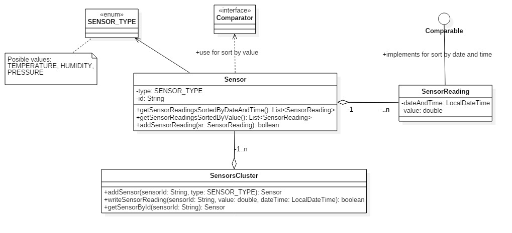
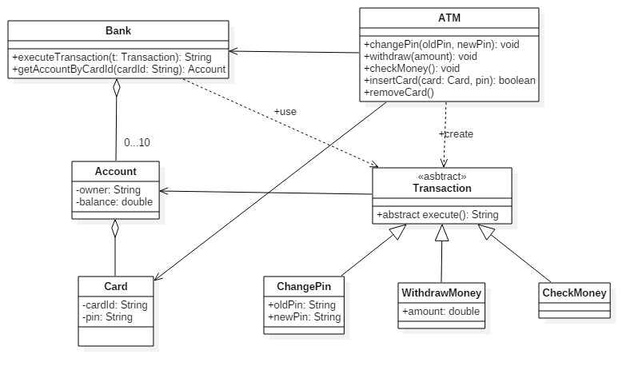

# Projects

1. In the folder Sql I have the project code.It creates some tables, it populate them and it applies 
different functions/procedures/trigger to tables. Code describe an school structure 
through our eyes.

2.Parking sensor project. It is an arduino project which has registry programing.I used C Embedded programing.
The ultrasonic sensor transmits waves, which are converted to electrical impulse.Based on the electrical impulse
I made a 4 digit printer and a PWM signal for led, buzzer. When the sensor measure is high(200 cm) the led will slowly pulse,
when the sensor measure is low(10 cm) the led light is slightly interrupted.The buzzer works same as the led. 

3.My java homework:

#Exercise 1


1. Create Java class based on the diagram above. 
    * _SensorReading_ should should implement ```Comparable<SensorReading>``` for comparing by date and time
    * _Sensor_ should use ```Comparator<SensorReading>``` for comparing _SensorReading_ by value
2. Demonstrate the functionality of application in Exercise1 class main method.
    * Use _SensorsCluster.addSensor_ to add few sensors. NOTE: The method should return an instance to the newly created Sensor object or null if a sensor with given id already exists
    * Use _SensorsCluster.writeSensorReading_ to add some readings for previously added sensors. This method should search for sensor by sensorId and use the sensor addSensorReading() to add a new value. Method will return false if sensor cannot be found
    * Use _SensorsCluster.getSensorById_ to obtain a reference for a previously added sensor and display sorted readings by the 2 provided criterias
3. Create minimal unit tests for testing the behavior of the program.

#Exercise 2


1. Create Java class based on the diagram above. 
    * _insertCard()_ method from ATM will compare received pin with the pin stored in card. If 2 pins match the card will be stored as attribute and will be used for executing transactions.
    * _removeCard()_ method will _invalidate_ a previously inserted card by making the attribute null. 
2. Demonstrate the functionality of application in Exercise1 class main method.
3. Create minimal unit tests for testing the behavior of the programm.